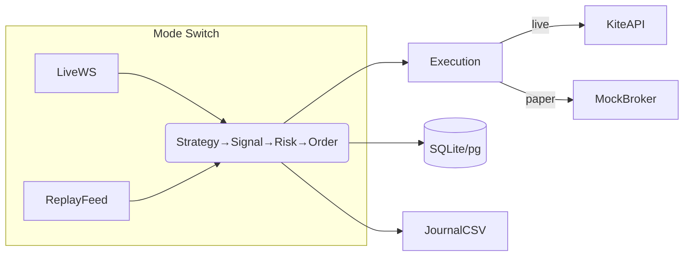

# Architecture Overview

```mermaid
flowchart LR
  subgraph Mode Switch
    LiveWS --> Core
    ReplayFeed --> Core
  end
  Core(Strategy→Signal→Risk→Order) --> Execution
  Execution -->|live| KiteAPI
  Execution -->|paper| MockBroker
  Core --> PortfolioDB[(SQLite/pg)]
  Core --> JournalCSV
```

Key design: **single code‑path**; swap data source + execution layer via `--mode`.
